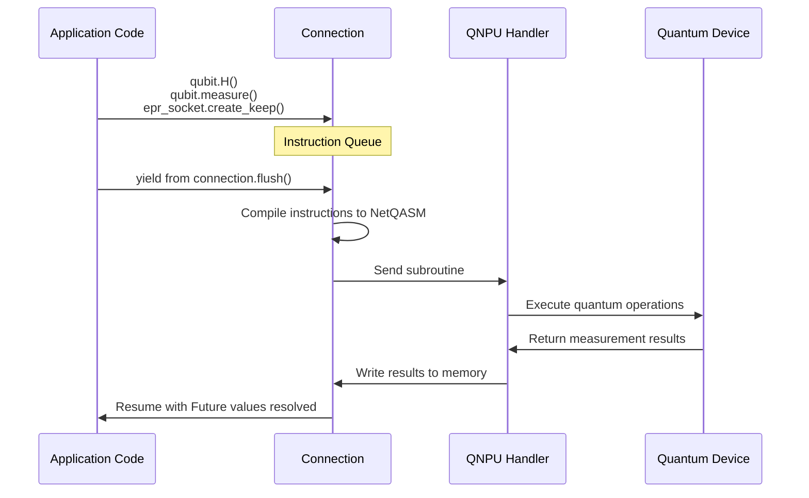

# SquidASM Architecture Overview

## System Design and Stack Layers

SquidASM implements a layered architecture that mirrors the software stack intended for physical quantum networks. The system is built on top of [NetSquid](https://netsquid.org/) for quantum simulation and [NetQASM SDK](https://github.com/QuTech-Delft/netqasm) for quantum programming.

### Architectural Layers

```
┌─────────────────────────────────────────────────────────────┐
│                    Application Layer                         │
│         (User Programs - application.py)                     │
│      AliceProgram, BobProgram, ServerProgram, etc.          │
└────────────────────┬────────────────────────────────────────┘
                     │
         NetQASM SDK Interface (Connection, EPRSocket, etc.)
                     │
┌────────────────────▼────────────────────────────────────────┐
│                      Host Layer                              │
│       (Program execution, classical sockets, state)          │
│              HostComponent, HostProtocol                     │
└────────────────────┬────────────────────────────────────────┘
                     │
           Classical Sockets (csockets)
           EPR Sockets (epr_sockets)
                     │
┌────────────────────▼────────────────────────────────────────┐
│              QNodeOS (QNOS) Layer                            │
│  ┌──────────────┬────────────────┬──────────────────────┐   │
│  │   Handler    │   Processor    │      Netstack        │   │
│  │ (Manages     │ (Quantum       │ (EPR pair           │   │
│  │  state,      │  operations)   │  generation)        │   │
│  │  sockets)    │                │                     │   │
│  └──────────────┴────────────────┴──────────────────────┘   │
└────────────────────┬────────────────────────────────────────┘
                     │
              NetQASM Subroutines
                     │
┌────────────────────▼────────────────────────────────────────┐
│              Quantum Device Layer                            │
│          (NetSquid QuantumProcessor)                         │
│     GenericQDevice, NVQDevice with noise models              │
└─────────────────────────────────────────────────────────────┘
```

### Conceptual Flow

1. **Application Layer**: User writes programs inheriting from `Program` class
2. **Host Layer**: Manages program execution, maintains classical socket connections, and interfaces with QNPU
3. **QNodeOS Layer**: Processes quantum instructions and manages entanglement generation
4. **Quantum Device**: Simulates quantum operations with configurable noise models

---

## Core Components

### 1. Application Interface (`Program`, `ProgramContext`, `ProgramMeta`)

Every SquidASM application consists of separate `Program` classes running on individual nodes. See [Program Interface documentation](../api/program_interface.md) for detailed information.

**Key Pattern**:
```python
class MyProgram(Program):
    @property
    def meta(self) -> ProgramMeta:
        # Declare required resources (qubits, sockets, etc.)
        return ProgramMeta(...)
    
    def run(self, context: ProgramContext):
        # Execute the program using resources from context
        # Yields to handle async operations
        yield from ...
```

### 2. Network Stack Components

Located in `squidasm/sim/stack/stack.py`:

#### StackNode
- NetSquid component representing a quantum network node
- Contains Host, QNodeOS, and Quantum Device subcomponents
- Manages all node-level state and resources

#### NodeStack (Protocol)
- Protocol wrapper managing Host and QNodeOS behavior
- Coordinates instruction flow between layers

#### StackNetwork
- Container for the complete network of nodes
- Manages classical sockets and quantum links between nodes

### 3. NetQASM Connection

The `QnosConnection` class (`squidasm/sim/stack/connection.py`) implements the NetQASM `BaseNetQASMConnection` interface:

**Key Concept**: Acts as a queue for quantum instructions. Instructions are not executed until `flush()` is called.

```
Program Code
    ↓
[Register instructions with connection]
    ↓
connection.flush()
    ↓
[Compile to NetQASM code]
    ↓
[Send to QNPU for execution]
    ↓
[Write results to shared memory]
```

### 4. Classical and Quantum Sockets

- **ClassicalSocket** (`squidasm/sim/stack/csocket.py`): Handles classical message passing between nodes
- **EPRSocket** (from NetQASM SDK): Handles entanglement generation between nodes

---

## Execution Flow: Connection Lifecycle

### Program Execution Sequence



### Key Points

1. **Queuing Phase**: All quantum operations are registered but not executed
2. **Compilation Phase**: Instructions are compiled to NetQASM assembly language
3. **Execution Phase**: Compiled code runs on the QNPU
4. **Result Collection**: Measurement and EPR results are made available to the program

---

## Network Architecture

### Two-Node Network

```
┌─────────────────────────────────────────────────────────┐
│                                                           │
│    ┌──────────────┐                    ┌──────────────┐  │
│    │   Alice      │                    │     Bob      │  │
│    │ (StackNode)  │                    │ (StackNode)  │  │
│    └──────────────┘                    └──────────────┘  │
│         │                                      │         │
│         │ EPR Link                             │         │
│         └──────────────────────────────────────┘         │
│                                                           │
│         │ Classical Link (optional)            │         │
│         └──────────────────────────────────────┘         │
│                                                           │
└─────────────────────────────────────────────────────────┘
```

### Multi-Node Network

Networks with 3+ nodes require:
- One link (EPR or classical) between each pair of nodes that communicate
- Links are optional; only required for communication pairs

---

## Configuration System

See [Configuration Documentation](../api/configuration.md) for detailed specifications.

### Network Configuration Structure

```yaml
stacks:
  - name: Alice
    qdevice_typ: generic
    qdevice_cfg: {...}
  
  - name: Bob
    qdevice_typ: generic
    qdevice_cfg: {...}

links:
  - stack1: Alice
    stack2: Bob
    typ: depolarise
    cfg: {...}

clinks:
  - stack1: Alice
    stack2: Bob
    typ: default
    cfg: {...}
```

### Three Types of Configurations

1. **Stack Configuration**: Node hardware specifications (qubit count, noise parameters, gate times)
2. **Link Configuration**: Quantum link models (EPR pair generation with noise)
3. **CLink Configuration**: Classical link models (message latency, instant vs delayed)

---

## Host-QNPU Interface

### Host Component

The `HostComponent` in `squidasm/sim/stack/host.py`:
- Manages program execution lifecycle
- Maintains socket connections to peer nodes
- Handles shared memory for results
- Implements the event-driven protocol pattern

### NetQASM Connection Role

Acts as the bridge between:
- **Host**: Receives classical instructions and I/O operations
- **QNPU Handler**: Processes quantum instructions
- **Shared Memory**: Stores qubit state and measurement results

---

## Quantum Device Models

### Generic Device

Idealized model supporting:
- All standard quantum gates (X, Y, Z, H, CNOT, CZ)
- Configurable noise: decoherence (T1, T2) and gate depolarization
- Arbitrary qubit count

### NV (Nitrogen-Vacancy) Device

Realistic model with:
- One electron qubit + N carbon qubits
- Limited gate set: rotations and directed-control gates only
- Electron-qubit measurements only
- Electron-carbon coupling constraints
- More detailed noise specification

See [Configuration Documentation](../api/configuration.md) for detailed parameters.

---

## Simulation Execution Model

### Run Function

The `run()` function (`squidasm/run/stack/run.py`) orchestrates:

```python
def run(
    config: StackNetworkConfig,
    programs: Dict[str, Program],
    num_times: int = 1,
    linear: bool = False
) -> List[List[Dict[str, Any]]]:
```

**Execution Flow**:
1. Load network configuration
2. Create StackNetwork based on configuration
3. For each iteration:
   - Reset quantum state
   - Run each program concurrently (or sequentially if linear=True)
   - Collect returned dictionaries
4. Return nested results structure

**Results Structure**: `List[List[Dict]]`
- Outer list: per node
- Middle list: per iteration
- Inner dict: return value from program

---

## Module Organization

```
squidasm/
├── nqasm/                    # NetQASM SDK interface layer
│   ├── __init__.py
│   ├── multithread.py        # Multi-threaded execution
│   └── netstack.py           # Network stack for NetQASM
│
├── run/                      # Simulation setup and execution
│   └── stack/
│       ├── config.py         # Configuration classes
│       ├── run.py            # Main run() function
│       └── build.py          # Network building utilities
│
├── sim/                      # Internal simulation components
│   └── stack/
│       ├── program.py        # Program, ProgramMeta, ProgramContext
│       ├── stack.py          # StackNode, NodeStack, StackNetwork
│       ├── host.py           # Host component and protocol
│       ├── qnos.py           # QNodeOS component and protocol
│       ├── processor.py      # Quantum instruction processor
│       ├── netstack.py       # Network stack for EPR generation
│       ├── connection.py     # NetQASM connection implementation
│       ├── csocket.py        # Classical socket implementation
│       └── common.py         # Logging, memory management utilities
│
└── util/                     # Utility functions and routines
    ├── util.py               # Network creation helpers
    ├── routines.py           # Pre-built quantum routines
    └── qkd_routine.py        # QKD-specific routines
```

---

## Key Design Patterns

### 1. Async/Await with Generators

SquidASM uses Python generators (`yield from`) for async execution:

```python
# Block until socket receives message
message = yield from csocket.recv()

# Block until EPR pair is ready
epr_qubit = epr_socket.create_keep()[0]

# Block and flush all queued instructions
yield from connection.flush()
```

### 2. Lazy Evaluation (Future Objects)

Quantum operation results are `Future` objects until `flush()`:

```python
result = qubit.measure()  # Future, not an integer
yield from connection.flush()
print(int(result))  # Now has a value
```

Restrictions before flush:
- Cannot use in native Python `if`/`for`/`while`
- Cannot convert to native types
- Must use NetQASM SDK control flow methods

### 3. Resource Declaration

Programs declare requirements upfront via `ProgramMeta`:

```python
return ProgramMeta(
    name="Alice",
    csockets=["Bob"],
    epr_sockets=[("Bob", 1)],
    max_qubits=10
)
```

This enables:
- Validation of network connectivity
- Proper initialization of sockets
- Memory allocation
- Better error reporting

### 4. Configuration-as-Code

Network configurations support both:
- **YAML files**: Human-readable, persistent
- **Programmatic creation**: Dynamic, for parameter sweeps

---

## Quantum Instruction Flow: Detailed Example

### Example: EPR Pair with Measurement

```python
# Application code
epr_qubit = epr_socket.create_keep()[0]
epr_qubit.H()
result = epr_qubit.measure()
yield from connection.flush()
measured_value = int(result)
```

**Behind the scenes**:

1. **create_keep()**: Register EPR request with netstack
2. **H()**: Queue Hadamard instruction with connection
3. **measure()**: Queue measurement instruction, return Future
4. **flush()**:
   - Compile all queued instructions to NetQASM code
   - Send EPR request to quantum link simulator
   - Send measurement subroutine to QNPU processor
   - QNPU executes on quantum device
   - Results written to shared memory
   - Future objects resolved to actual values
5. **int(result)**: Convert Future to native Python int

---

## Cross-Layer Communication

### Example: Classical Message with EPR Coordination

```
Alice                          Bob
  │                              │
  ├─ Create EPR with Bob ───────→ Listen for EPR
  │                              │
  ├─ Apply gates                 ├─ Apply gates
  │                              │
  ├─ Flush instructions         ├─ Flush instructions
  │                              │
  ├─ Send measurement result ───→ Receive result
  │                              │
  └─ Complete                    └─ Complete
```

This coordination happens through:
- **EPR Socket**: Automatic via Netstack (asyncio-based)
- **Classical Socket**: Explicit `send()` and `yield from recv()`
- **Timing**: NetSquid simulation clock ensures causal order

---

## Next Steps

For deeper understanding:
- [Program Interface & Lifecycle](../api/program_interface.md) - Detailed program structure
- [Context and Network Stack](../api/context_and_stack.md) - Runtime context and stack internals
- [Configuration Guide](../api/configuration.md) - Network and device specifications
- [Foundations: NetQASM](../foundations/netqasm.md) - Quantum programming language
- [Foundations: EPR & Entanglement](../foundations/epr_sockets.md) - Quantum link operations
- [Foundations: Classical Communication](../foundations/classical_communication.md) - Message passing
